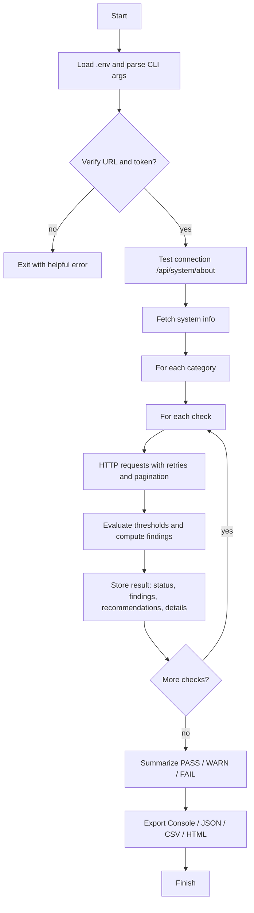
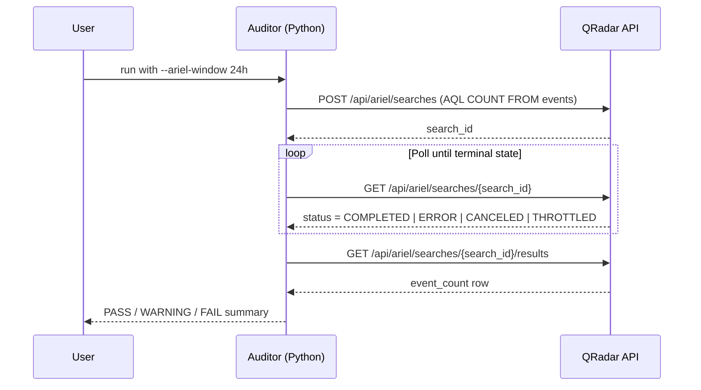
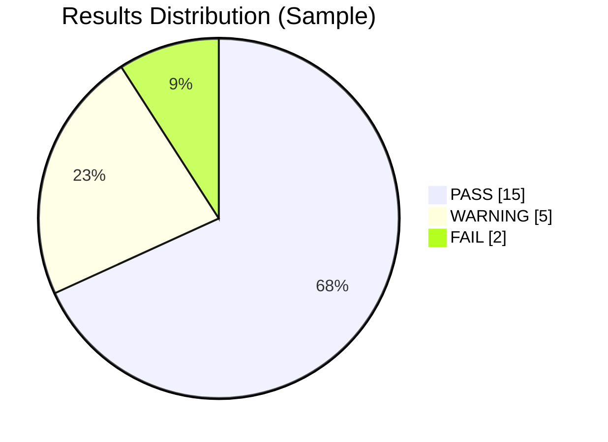

# QRadar SIEM Auditor


A comprehensive tool for auditing IBM QRadar SIEM implementations against security best practices, providing detailed evaluation and actionable recommendations for improvement.

> **Script:** `qradar-siem-auditor.py` (enhanced, resilient HTTP, pagination, retries, CLI filters, and multi-format reports)

---

## 📋 Overview

QRadar SIEM Auditor helps security teams evaluate QRadar deployments using the official REST APIs. It runs targeted checks across critical dimensions, then summarizes findings with PASS/WARNING/FAIL statuses and prioritized recommendations.

### Key Enhancements (Plus Edition)

- ✅ Robust HTTP layer: timeouts, retries with exponential backoff, and **Range/Content-Range pagination**
- ✅ **Ariel polling** handled safely (COMPLETED/ERROR/CANCELED/THROTTLED) with configurable window (e.g., `--ariel-window 24h`)
- ✅ **CLI filters** to include/exclude categories or checks; `--list-checks` to discover available checks
- ✅ **Multi-format outputs**: Console, JSON, CSV, and clean HTML (no extra deps)
- ✅ **Debug logging** to file (`--log-file`) and verbose console with `--debug`
- ✅ **Dry run** mode to validate flow without hitting QRadar
- ✅ Clear **error handling** per check—one failure won't stop the audit

---

## 🔍 What Gets Audited

Six categories with 20+ checks:

1. **Data Collection**
   - Log source configuration and status
   - Event collection rates (Ariel search)
   - Coverage across critical systems
   - Health % of problematic sources

2. **System Configuration**
   - Health (CPU/RAM/IO placeholders or use your endpoint)
   - Deployment architecture
   - Storage utilization & retention
   - Backup configuration

3. **Security Configuration**
   - User access controls & inactivity
   - Password policy (example template)
   - Network hardening (TLS/ciphers/ACLs)
   - Authentication methods (LDAP/RADIUS/SAML/MFA)

4. **Detection Capabilities**
   - Custom/system rules; stale/never-fired
   - Offense pipeline health (aging buckets)
   - ATT&CK-style coverage (example template)
   - Reference set hygiene

5. **Operational Efficiency**
   - Search performance
   - Reports & scheduling
   - Dashboards
   - Retention policies

6. **Integration & Data Flow**
   - External integrations health
   - Data exports (age/frequency/destinations)
   - API usage & deprecations

---

## 🧠 How It Works



### Ariel Search Workflow (Event Count)



### Example Results Chart (Mermaid Pie)

> Replace numbers with your actual run results if you want to visualize.



---

## 🚀 Installation

### Prerequisites

- **Python 3.8+**
- Access to a QRadar instance with API permissions
- Required Python packages:
  - `requests`
  - `pandas`
  - `colorama`
  - `python-dotenv`

### Setup

1. Clone this repository:
   ```bash
   git clone https://github.com/Masriyan/qradar-siem-auditor.git
   cd qradar-siem-auditor
   ```

2. Install required dependencies:
   ```bash
   pip install -r requirements.txt
   # or
   pip install requests pandas colorama python-dotenv
   ```

3. Create a `.env` file with your QRadar credentials:
   ```ini
   QRADAR_URL=https://your-qradar-console.example.com
   QRADAR_TOKEN=your-api-token
   VERIFY_SSL=True
   ```

---

## 📊 Usage

Basic run:
```bash
python qradar-siem-auditor.py --export console
```

Export everything (Console + files):
```bash
python qradar-siem-auditor.py --export console json csv html
```

Selectively run categories/checks:
```bash
# List options
python qradar-siem-auditor.py --list-checks

# Only Data Collection (name match is case-insensitive)
python qradar-siem-auditor.py --include-category "Data Collection"

# Include/Exclude specific checks
python qradar-siem-auditor.py --include-check "Log Sources" --exclude-check "Log Source Status"
```

Tune networking and pagination:
```bash
python qradar-siem-auditor.py \
  --timeout 30 --max-retries 4 --backoff 2.0 \
  --page-size 100 --ariel-window 24h
```

Diagnostics and safety:
```bash
# Verbose console + debug log file
python qradar-siem-auditor.py --debug --log-file qradar_audit.log

# Dry run (no API calls; sanity test)
python qradar-siem-auditor.py --dry-run

# Disable SSL verification (use only in trusted networks!)
python qradar-siem-auditor.py --verify-ssl False
```

### Example Console Output (abridged)
```
=== QRadar SIEM Audit Tool ===
Target: https://qradar.example.com
Time: 2025-08-20 14:30:45

Successfully connected to QRadar API.
Auditing Data Collection…
  Checking Log Sources…           Status: PASS
  Checking Event Collection Rate… Status: WARNING
  Checking Log Source Coverage…   Status: PASS
  Checking Log Source Status…     Status: WARNING
...
=== QRadar SIEM Audit Report ===
Generated: 2025-08-20 15:12:33
Target: https://qradar.example.com
QRadar Version: 7.5.x

Summary
  Total: 22 | Pass: 15 | Warn: 5 | Fail: 2
Critical
  1) System Configuration - Storage Utilization: High storage utilization (92.5%)
  2) Detection Capabilities - Offense Configuration: High number of active offenses: 156
```

---

## ⚙️ Configuration & Customization

### Thresholds
Change PASS/WARNING/FAIL thresholds directly in each check (search for `concerns.append` and comparison lines). Example:
```python
# More strict storage threshold
if utilization_percentage > 75:
    concerns.append(f"High storage utilization ({utilization_percentage:.1f}%)")
```

### Adding a New Check
1. Implement a method that returns a dict:
   ```python
   def _check_new_feature(self):
       return {
           "status": "PASS",
           "findings": "All good",
           "recommendations": "Keep monitoring",
           "details": {"example": 1},
       }
   ```
2. Register it in `self.audit_categories["Some Category"]["New Feature"] = self._check_new_feature`.

### Outputs
- **JSON**: full system info + results
- **CSV**: one row per check
- **HTML**: pretty, dependency-free report (great for sharing)

All files are written to a timestamped folder under `./out/` (shown at the end of a run).

---

## 📄 Required API Endpoints

Ensure your API token can access:
- `/api/system/about`
- `/api/system/servers`
- `/api/config/event_sources/log_source_management/log_sources`
- `/api/ariel/searches`
- `/api/siem/offenses`
- `/api/analytics/rules`
- `/api/config/access/users`
- `/api/reference_data/sets`

**Create token**: Admin → User Management → Authorized Services → New service → Assign role → Generate token → put in `.env`.

---

## 🔒 Security Notes

- Do **not** commit `.env` to version control
- Prefer a read-only service account with least privilege
- Consider running audits during off-peak hours
- If you must set `--verify-ssl False`, only do so on trusted networks

---

## 🧰 Troubleshooting

- **401/403**: Token missing scope or expired → regenerate with proper role
- **5xx/429**: Temporary server or rate limit → script retries with backoff; increase `--timeout` or reduce `--page-size`
- **Ariel search stuck**: Script stops on terminal states; try a smaller `--ariel-window`
- **HTML/CSV looks empty**: Check console for per-check errors; re-run with `--debug`

---

## 🤝 Contributing

1. Fork the repository
2. Create a feature branch: `git checkout -b new-feature`
3. Commit: `git commit -am "Add new feature"`
4. Push: `git push origin new-feature`
5. Open a pull request

---

## 📝 License

This project is licensed under the MIT License — see `LICENSE` for details.

---

*Disclaimer: This tool is not affiliated with or endorsed by IBM. QRadar is a registered trademark of IBM. Use at your own risk; test in non-production first.*
