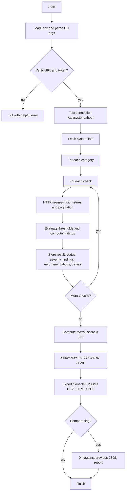
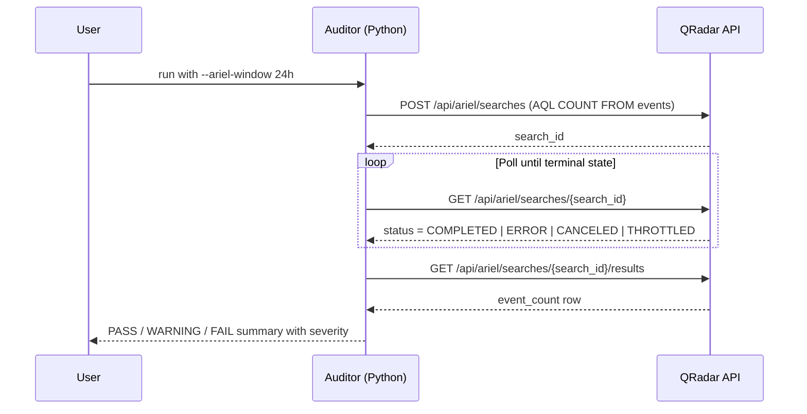
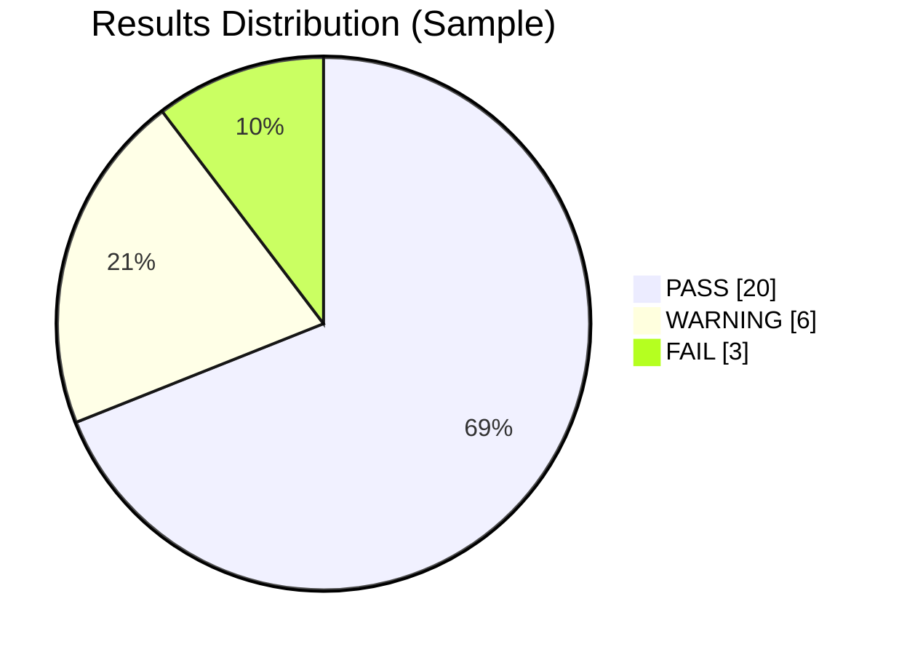

# QRadar SIEM Auditor


A comprehensive tool for auditing IBM QRadar SIEM implementations against security best practices, providing detailed evaluation, severity-weighted scoring, and actionable recommendations for improvement.

> **Script:** `qradar-siem-auditor.py` (robust HTTP, pagination, retries, CLI filters, severity scoring, multi-format reports, audit comparison)

---

## 📋 Overview

QRadar SIEM Auditor helps security teams evaluate QRadar deployments using the official REST APIs. It runs 29 targeted checks across 8 critical dimensions, computes a **weighted overall score (0–100)**, and outputs detailed reports with prioritized recommendations.

### Key Features

- ✅ **29 audit checks** across 8 categories
- ✅ **Severity scoring** (1–10 per check) with **overall audit score** (0–100)
- ✅ Robust HTTP layer: timeouts, retries with exponential backoff, and **Range/Content-Range pagination**
- ✅ **Ariel polling** handled safely (COMPLETED/ERROR/CANCELED/THROTTLED) with configurable window
- ✅ **CLI filters** to include/exclude categories or checks; `--list-checks` to discover available checks
- ✅ **5 export formats**: Console, JSON, CSV, HTML, and **PDF** (via `fpdf2`)
- ✅ **Audit comparison** mode (`--compare`) to diff two JSON audit runs
- ✅ **Debug logging** to file (`--log-file`) and verbose console with `--debug`
- ✅ **Dry run** mode to validate flow without hitting QRadar
- ✅ Clear **error handling** per check—one failure won't stop the audit

---

## 🔍 What Gets Audited

Eight categories with 29 checks:

1. **Data Collection**
   - Log source configuration and status
   - Event collection rates (Ariel search)
   - Coverage across critical systems
   - Health % of problematic sources

2. **System Configuration**
   - Health (CPU/RAM/IO placeholders or use your endpoint)
   - Deployment architecture
   - Storage utilization & retention
   - Backup configuration

3. **Security Configuration**
   - User access controls & inactivity
   - Password policy (example template)
   - Network hardening (TLS/ciphers/ACLs)
   - Authentication methods (LDAP/RADIUS/SAML/MFA)

4. **Detection Capabilities**
   - Custom/system rules; stale/never-fired
   - Offense pipeline health (aging buckets)
   - ATT&CK-style coverage (example template)
   - Reference set hygiene

5. **Operational Efficiency**
   - Search performance
   - Reports & scheduling
   - Dashboards
   - Retention policies

6. **Integration & Data Flow**
   - External integrations health
   - Data exports (age/frequency/destinations)
   - API usage & deprecations

7. **Compliance & Governance** _(New in v2.0)_
   - Patch level — version vs supported releases
   - License compliance — EPS utilization vs licensed cap
   - Audit trail — admin login activity & dormant accounts

8. **Performance & Tuning** _(New in v2.0)_
   - EPS capacity — event processing headroom
   - Ariel disk usage — partition utilization & compression
   - Flow dedup ratio — deduplication effectiveness

---

## 🧠 How It Works



### Severity Scoring System

Each check carries a **severity weight** (1–10):

| Severity | Meaning                 | Examples                         |
| -------- | ----------------------- | -------------------------------- |
| 9–10     | Critical infrastructure | Log Sources, Backup, Patch Level |
| 7–8      | Important security/ops  | User Access, Rules, EPS Capacity |
| 5–6      | Operational hygiene     | Integrations, API Usage, Dedup   |
| 1–4      | Informational           | Dashboards, Reports              |

**Overall Score** = weighted average where PASS=100%, WARNING=50%, FAIL=0%.

### Ariel Search Workflow (Event Count)



### Example Results Chart (Mermaid Pie)

> Replace numbers with your actual run results if you want to visualize.



---

## 🚀 Installation

### Prerequisites

- **Python 3.8+**
- Access to a QRadar instance with API permissions
- Required Python packages (see `requirements.txt`):
  - `requests`
  - `pandas`
  - `colorama`
  - `python-dotenv`
  - `fpdf2` _(for PDF export)_

### Setup

1. Clone this repository:

   ```bash
   git clone https://github.com/Masriyan/qradar-siem-auditor.git
   cd qradar-siem-auditor
   ```

2. Install required dependencies:

   ```bash
   pip install -r requirements.txt
   ```

3. Create a `.env` file with your QRadar credentials:
   ```ini
   QRADAR_URL=https://your-qradar-console.example.com
   QRADAR_TOKEN=your-api-token
   VERIFY_SSL=True
   ```

---

## 📊 Usage

Basic run:

```bash
python qradar-siem-auditor.py --export console
```

Export everything (Console + files):

```bash
python qradar-siem-auditor.py --export console json csv html pdf
```

Selectively run categories/checks:

```bash
# List options
python qradar-siem-auditor.py --list-checks

# Only Compliance & Governance
python qradar-siem-auditor.py --include-category "Compliance & Governance"

# Include/Exclude specific checks
python qradar-siem-auditor.py --include-check "Log Sources" --exclude-check "Log Source Status"
```

Compare against a previous audit:

```bash
# Run audit and export JSON
python qradar-siem-auditor.py --export console json

# Later, compare against the saved report
python qradar-siem-auditor.py --export console --compare out/qradar_audit_20250820_143045/report.json
```

Tune networking and pagination:

```bash
python qradar-siem-auditor.py \
  --timeout 30 --max-retries 4 --backoff 2.0 \
  --page-size 100 --ariel-window 24h
```

Diagnostics and safety:

```bash
# Verbose console + debug log file
python qradar-siem-auditor.py --debug --log-file qradar_audit.log

# Dry run (no API calls; sanity test)
python qradar-siem-auditor.py --dry-run

# Disable SSL verification (use only in trusted networks!)
python qradar-siem-auditor.py --verify-ssl False
```

### Example Console Output (abridged)

```
=== QRadar SIEM Audit Tool ===
Target: https://qradar.example.com
Time: 2026-02-28 02:25:00

Successfully connected to QRadar API.
QRadar Version: 7.5.4

Auditing Data Collection…
  Checking Log Sources…           Status: PASS
  Checking Event Collection Rate… Status: WARNING
  Checking Log Source Coverage…   Status: PASS
  Checking Log Source Status…     Status: WARNING
...
Overall Audit Score: 74/100

=== QRadar SIEM Audit Report ===
  Overall Score: 74/100
  Total Checks: 29
  Passed: 20 (69.0%)
  Warnings: 6 (20.7%)
  Failures: 3 (10.3%)

Detailed Results:

Data Collection:
  Log Sources: PASS  [severity: 9/10]
    Findings: 45 log sources found; 42 enabled.
    Recommendations: Continue monitoring and add new sources as needed.
...
```

---

## ⚙️ Configuration & Customization

### Thresholds

Change PASS/WARNING/FAIL thresholds directly in each check (search for `concerns.append` and comparison lines). Example:

```python
# More strict storage threshold
if utilization_percentage > 75:
    concerns.append(f"High storage utilization ({utilization_percentage:.1f}%)")
```

### Severity Weights

Adjust severity weights in the `SEVERITY_MAP` dictionary at the top of the script:

```python
SEVERITY_MAP = {
    "Log Sources": 9,       # Critical
    "Dashboards": 4,         # Informational
    "Patch Level": 9,        # Critical
    ...
}
```

### Adding a New Check

1. Implement a method that returns a dict:
   ```python
   def _check_new_feature(self):
       return {
           "status": "PASS",
           "findings": "All good",
           "recommendations": "Keep monitoring",
           "details": {"example": 1},
       }
   ```
2. Register it in `self.audit_categories["Some Category"]["New Feature"] = self._check_new_feature`.
3. Add a severity weight in `SEVERITY_MAP["New Feature"] = 7`.

### Outputs

- **JSON**: full system info + results with severity
- **CSV**: one row per check with severity column
- **HTML**: styled report with score badge, severity column, and color-coded statuses
- **PDF**: branded audit report with summary, per-category tables, and score
- **Comparison**: `--compare` flag produces a delta table (▲ Improved / ▼ Regressed / — Unchanged)

All files are written to a timestamped folder under `./out/` (shown at the end of a run).

---

## 📄 Required API Endpoints

Ensure your API token can access:

- `/api/system/about`
- `/api/system/servers`
- `/api/config/event_sources/log_source_management/log_sources`
- `/api/ariel/searches`
- `/api/siem/offenses`
- `/api/analytics/rules`
- `/api/config/access/users`
- `/api/reference_data/sets`

**Create token**: Admin → User Management → Authorized Services → New service → Assign role → Generate token → put in `.env`.

---

## 🔒 Security Notes

- Do **not** commit `.env` to version control
- Prefer a read-only service account with least privilege
- Consider running audits during off-peak hours
- If you must set `--verify-ssl False`, only do so on trusted networks
- See [SECURITY.md](SECURITY.md) for our vulnerability disclosure policy

---

## 🧰 Troubleshooting

- **401/403**: Token missing scope or expired → regenerate with proper role
- **5xx/429**: Temporary server or rate limit → script retries with backoff; increase `--timeout` or reduce `--page-size`
- **Ariel search stuck**: Script stops on terminal states; try a smaller `--ariel-window`
- **HTML/CSV looks empty**: Check console for per-check errors; re-run with `--debug`
- **PDF export skipped**: Install `fpdf2` → `pip install fpdf2`

---

## 🤝 Contributing

See [CONTRIBUTING.md](CONTRIBUTING.md) for guidelines on:

- Setting up your development environment
- Adding new audit checks
- Code style and PR process

---

## 📝 License

This project is licensed under the MIT License — see [LICENSE](LICENSE) for details.

---

_Disclaimer: This tool is not affiliated with or endorsed by IBM. QRadar is a registered trademark of IBM. Use at your own risk; test in non-production first._
